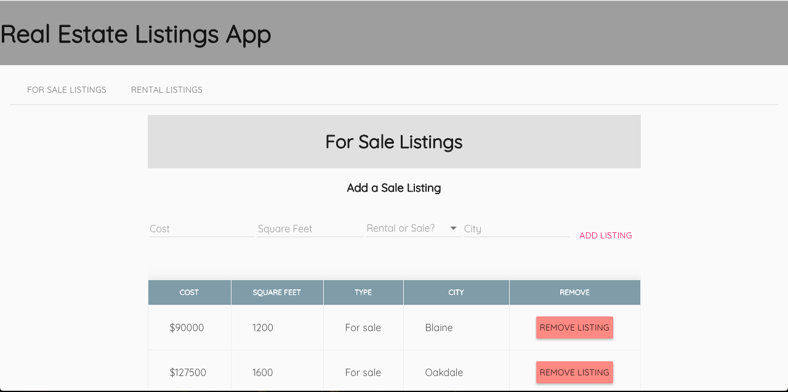

# AngularJS Real Estate Listings Code Challenge
This app was built for a code challenge for Prime Academy. The app is pretty simple in functionality with letting a user add either a rental or sales listing and the ability to remove any listing. 

## Tech Used
* AngularJS
* Node.js
* Express.js
* PostgreSQL
* AngularJS Material-Design

### Stretch Goals
* Give the user the ability to upload a picture with the listing
